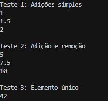

# Update Median
## O problema
Você começa com uma lista vazia de números e pode adicionar ou remover valores. Após cada operação, deve calcular e exibir a mediana dos números presentes na lista.

A mediana é definida como:
* Se a quantidade de números é ímpar: o número do meio após ordenação
* Se a quantidade de números é par: a média dos dois números do meio após ordenação

As entradas esperadas são:
* `n`: número de operações
* Para cada operação: `a x` (adicionar x) ou `r x` (remover x)

A saída esperada para cada operação:
* Se adicionar: a mediana após a adição
* Se remover e x não existe: "Wrong!"
* Se remover e x existe: a mediana após remoção
* Se a lista ficar vazia: "Wrong!"

## A resolução
Pra resolver esse problema, usei dois heaps (max-heap e min-heap) para manter os números divididos em duas metades. A estratégia é:

1. Max-heap guarda a metade menor dos números (raiz = maior da metade menor)
2. Min-heap guarda a metade maior dos números (raiz = menor da metade maior)
3. Mantenho os heaps balanceados: max-heap tem no máximo 1 elemento a mais que min-heap

Para cada operação:
- Adicionar: insiro no heap apropriado e rebalanceio
- Remover: uso um dicionário de contagem para rastrear frequências, reconstruo os heaps quando necessário
- Calcular mediana: 
  - Se heaps têm tamanho igual: média das duas raízes
  - Se max-heap é maior: raiz do max-heap

## Capturas de tela (Saída dos testes)

## Conclusões
O algoritmo que usei foi dois heaps balanceados. A alternativa seria manter uma lista ordenada, mas inserção seria O(n) e remoção também O(n). Com heaps, a inserção e remoção seriam O(log n).

## Referências
> GEEKSFORGEEKS. Find Median from Data Stream. GeeksforGeeks. Disponível em: https://www.geeksforgeeks.org/find-median-from-data-stream/