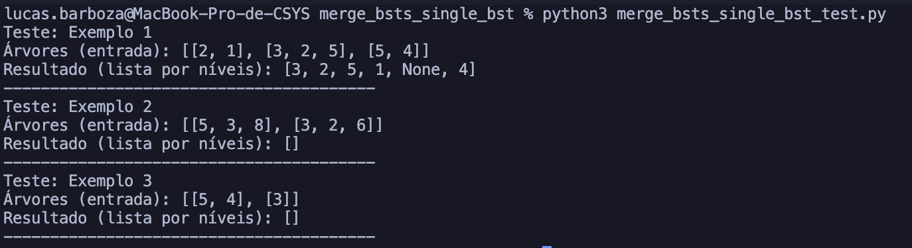

# Merge BSTs to Create Single BST

## Descrição do Problema

Recebemos uma lista de pequenas árvores binárias de busca (BSTs). Cada árvore possui um nó raiz e, opcionalmente, filhos à esquerda e à direita. Queremos verificar se é possível combinar todas elas em uma única BST que contenha todos os valores, respeitando a ordem de uma árvore de busca. A fusão só pode acontecer quando o valor do nó folha de uma árvore coincide com o valor do nó raiz de outra árvore; nesse caso, anexamos os filhos da segunda árvore ao nó folha correspondente.

## A resolução

A resolução do problema foi feita utilizando uma abordagem de busca em profundidade (DFS) para percorrer a árvore e verificar se é possível combinar todas as árvores em uma única BST.

Para isso, foi criado um mapa para armazenar as raízes das árvores e um contador para verificar quantas vezes cada valor aparece como filho (folha) em qualquer árvore.

O único valor elegível para ser a raiz final é aquele que não aparece como filho em nenhuma outra árvore.

Em seguida, foi percorrido a árvore candidata em profundidade (DFS), respeitando os limites de uma BST (faixa mínima e máxima permitida para cada nó).

Sempre que encontramos um nó folha cujo valor é o raiz de outra árvore ainda não usada, incorporamos essa subárvore.

Se, ao final da travessia, todas as árvores tiverem sido consumidas e nenhuma violação de BST for detectada, retornamos a raiz resultante.

Caso contrário, retornamos `None`.

## Capturas de tela

## Conclusão

A abordagem DFS mantém a validade da BST e garante que todas as árvores sejam consumidas. O uso de um mapa para armazenar as raízes e um contador de filhos facilita a identificação da raiz final e a verificação de duplicidades. Cada operação realizada é feita em tempo constante, resultando em uma complexidade temporal de O(n).

## Referências

> Binary Search Tree In Python. 23 Jul, 2025. Disponível em: https://www.geeksforgeeks.org/python/binary-search-tree-in-python/
