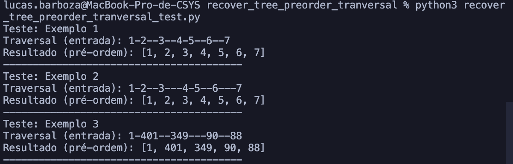

# Recover a Tree From Preorder Traversal

## Descrição do Problema

Recebemos uma string que representa o percurso em pré-ordem de uma árvore binária, usando hífens para indicar a profundidade de cada nó (quantos níveis ele está abaixo da raiz). A missão é reconstruir a árvore original a partir dessa string, devolvendo o nó raiz ao final.

## A resolução

A ideia gira em torno de caminhar pela string uma única vez, mantendo um ponteiro que indica em qual posição estamos. Para cada trecho, contamos quantos hífens aparecem — isso revela a profundidade esperada do próximo nó. Se a profundidade for a que esperávamos, lemos os dígitos seguintes como o valor do nó e criamos um `TreeNode`.

Logo depois, seguimos a ordem pré-ordem: primeiro criamos o filho da esquerda, depois o da direita, sempre aumentando a profundidade esperada. Esse movimento recursivo acontece até que encontremos um pedaço da string que não bate com a profundidade esperada; nesse caso, voltamos para completar a estrutura da árvore.

Ao final do processo, terminamos com a árvore montada exatamente na forma que ela tinha antes de virar string.

## Capturas de tela

## Conclusão

A abordagem recursiva com controle explícito de posição na string permite reconstruir a árvore em tempo linear, proporcional ao tamanho da entrada. Garantimos que cada caractere é lido apenas uma vez e respeitamos fielmente a ordem em pré-ordem. Cada operação realizada é feita em tempo constante, resultando em uma complexidade temporal de O(n).

## Referências

> DFS traversal of a Tree. 30 Oct, 2025. Disponível em: https://www.geeksforgeeks.org/dsa/dfs-traversal-of-a-tree-using-recursion/
