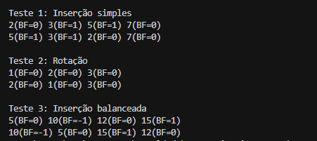

# Self Balancing Tree
## O problema
Você recebe um valor informando a quantidade de números que serão inseridos mantendo a propriedade de balanceamento. Uma árvore AVL é uma árvore binária de busca auto-balanceada onde a diferença de altura entre as subárvores esquerda e direita de qualquer nó (fator de balanceamento) não pode ser maior que 1.

O fator de balanceamento é definido como:
```
balanceFactor = altura(subárvore esquerda) - altura(subárvore direita)
```

As entradas esperadas são:
* `root`: a quantidade de números a serem inseridos na árvore.
* `new_val`: valor inteiro a ser inserido

A saída é o ponteiro para a nova raiz da árvore após a inserção e rotações necessárias.

## A resolução
Pra resolver esse problema, implementei a inserção recursiva padrão de BST seguida de rotações para manter o balanceamento. O algoritmo funciona assim:

1. Insiro o valor recursivamente seguindo as regras da BST (menor vai pra esquerda, maior pra direita)
2. Atualizo a altura do nó atual após a inserção
3. Calculo o fator de balanceamento do nó
4. Se o fator de balanceamento sair do intervalo [-1, 1], aplico rotações:
   - **Left-Left case** (bf > 1 e inserção na esquerda): rotação simples à direita
   - **Right-Right case** (bf < -1 e inserção na direita): rotação simples à esquerda
   - **Left-Right case** (bf > 1 e inserção na direita): rotação esquerda no filho + rotação direita no nó
   - **Right-Left case** (bf < -1 e inserção na esquerda): rotação direita no filho + rotação esquerda no nó

As rotações reorganizam a árvore mantendo a ordem BST e restaurando o balanceamento.

## Capturas de tela (Saída dos testes)


## Conclusões
O algoritmo que usei foi inserção AVL com rotações automáticas. A alternativa seria usar uma árvore binária de busca comum, mas isso poderia degenerar em O(n) no pior caso. Com AVL, a altura é mantida em O(log n), garantindo que todas as operações (busca, inserção, remoção) sejam O(log n).
